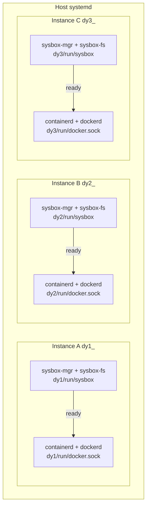
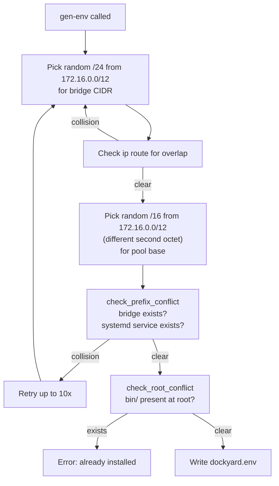
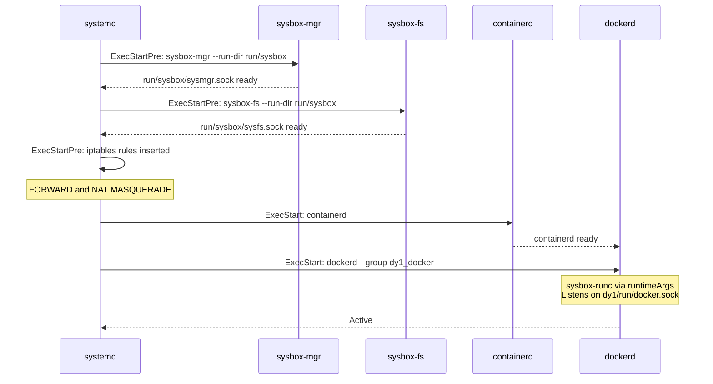
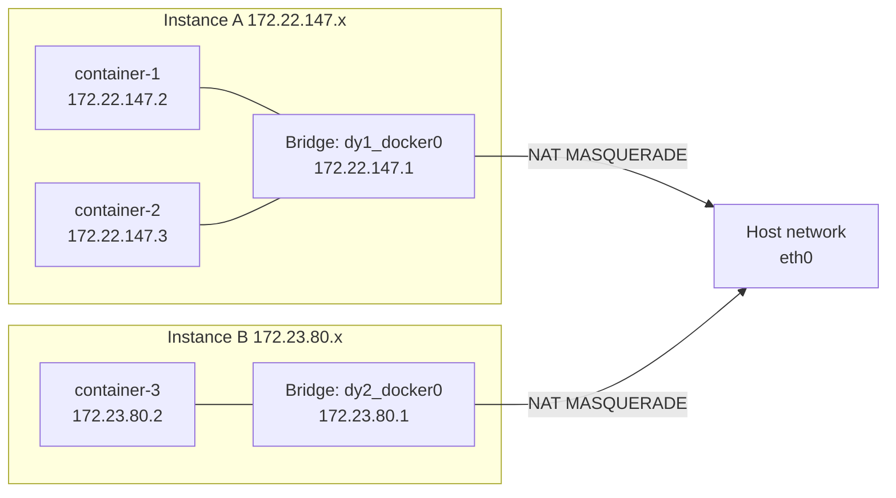
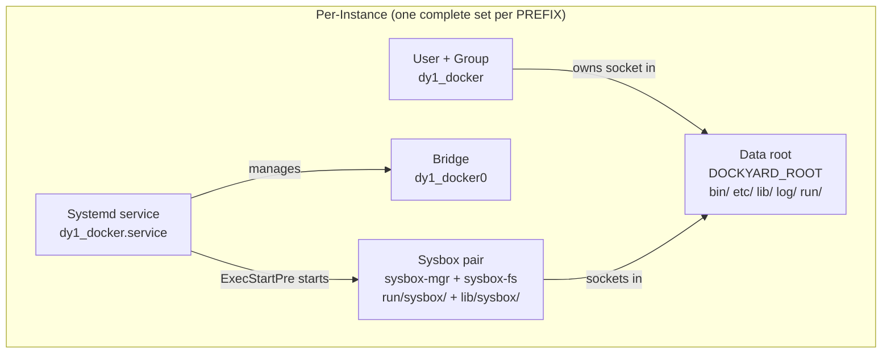
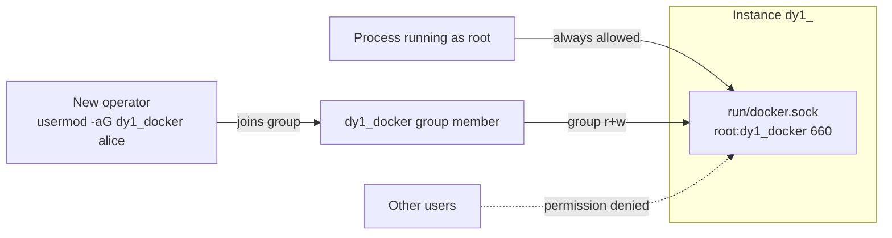

# Dockyard Architecture

A technical reference for how Dockyard works and the reasoning behind each major design decision.

---

## The Problem

Linux has one dockerd per host. That works until you need genuine daemon-level isolation: separate image stores, separate overlay networks, separate iptables rule sets, different runtimes per tenant, or the ability to destroy one workload's environment without touching another's. Namespaces and cgroups give you container-level isolation but a single daemon is still a single point of failure and a shared blast radius.

The naive fix — "just run more dockerd processes" — breaks immediately:

- **iptables chain collision.** Docker creates global chains (`DOCKER`, `DOCKER-FORWARD`, `DOCKER-USER`, `DOCKER-ISOLATION-STAGE-1`, `DOCKER-ISOLATION-STAGE-2`). When a second daemon starts it overwrites the rules the first daemon wrote. Whichever daemon reloads last wins; the others lose outbound connectivity silently.
- **Containerd socket conflict.** Multiple dockerd processes default to the same containerd socket path.
- **Shared bridge names.** Both daemons try to create `docker0`.
- **Sysbox singleton.** sysbox-mgr and sysbox-fs have hardcoded socket paths (`/run/sysbox/sysmgr.sock`, `/run/sysbox/sysfs.sock`) — only one pair can run per host with the upstream release.

Dockyard solves all four, with no kernel patches, no VMs, and no changes to the host Docker. The sysbox singleton constraint is resolved by using a fork that adds a `--run-dir` flag (see section 2).

---

## Architecture Overview



Each instance is fully independent: its own sysbox-mgr and sysbox-fs pair, its own bridge, subnet, iptables rules, containerd, socket, and data directory. There is no shared sysbox daemon.

---

## Design Decisions and Rationale

### 1. Explicit iptables — not `--iptables=true`

**The problem.** When Docker manages iptables it uses globally-named chains. Starting a second daemon stomps the first daemon's rules because `iptables -F DOCKER` flushes the entire chain regardless of which daemon owns which rule.

**The solution.** Set `--iptables=false` in every daemon's `daemon.json` and manage iptables entirely from the systemd service's `ExecStartPre` and `ExecStopPost` hooks. Each instance injects exactly four rules, all scoped to its own bridge name:

```
iptables -I FORWARD -i ${BRIDGE} -o ${BRIDGE} -j ACCEPT
iptables -I FORWARD -i ${BRIDGE} ! -o ${BRIDGE} -j ACCEPT
iptables -I FORWARD -o ${BRIDGE} -m conntrack --ctstate RELATED,ESTABLISHED -j ACCEPT
iptables -t nat -I POSTROUTING -s ${FIXED_CIDR} ! -o ${BRIDGE} -j MASQUERADE
```

Because every rule references `${BRIDGE}` (e.g. `dy1_docker0`), instances are mathematically incapable of interfering with each other. Teardown is equally clean: `ExecStopPost` removes the same four rules with `-D`.

**Why not nftables?** iptables is still the lowest common denominator for Ubuntu LTS, Debian, and the Alpine-derived VMs this tooling targets. nftables support is a natural future addition.

---

### 2. Per-instance sysbox daemon

**The constraint.** Nestybox sysbox 0.6.7 CE hardcodes its control socket paths at compile time:

```
/run/sysbox/sysmgr.sock   (sysbox-mgr)
/run/sysbox/sysfs.sock    (sysbox-fs)
```

There is no flag to change them. Running two sysbox-mgr processes on the same host is physically impossible — they fight over the same socket file. An earlier architecture worked around this by using a single shared `dockyard-sysbox.service`, but that means all instances share one sysbox process.

**The solution: fork sysbox.** The fork (`github.com/thieso2/sysbox`, version `0.6.7.9-tc`) adds `--run-dir <dir>` to all three sysbox binaries — `sysbox-mgr`, `sysbox-fs`, and `sysbox-runc`. `SetRunDir()` calls `os.Setenv("SYSBOX_RUN_DIR", dir)`, so passing `--run-dir` via `runtimeArgs` in `daemon.json` works correctly for all sockets including the seccomp tracer. No wrapper script is needed.

Each dockyard instance points its sysbox pair at its own directories (FHS layout):

```
${DOCKYARD_ROOT}/run/sysbox/    sockets (sysmgr.sock, sysfs.sock) + PID files
${DOCKYARD_ROOT}/lib/sysbox/    sysbox-mgr data-root + sysbox-fs mountpoint
```

All three sysbox binaries are per-instance inside `${BIN_DIR}/` (`${DOCKYARD_ROOT}/bin/`).

**Lifecycle.** sysbox-mgr and sysbox-fs start as `ExecStartPre` steps inside the per-instance docker service and are killed in `ExecStopPost`. There is no shared service and no ref-counting. Destroying any instance affects only its own sysbox processes.

---

### 3. Static Docker binaries — not distro packages

**Why not `apt install docker.io`?**

- Creates a system-wide `docker.service` that conflicts with instance services.
- Writes to `/usr/bin/dockerd` — shared across all instances, so you cannot run different Docker versions simultaneously.
- Ties instances to the host's package manager and upgrade cycles.
- Leaves global state on removal.

**Static binaries** are downloaded once, cached in `.tmp/`, and copied into `${BIN_DIR}/` during `create`. Each instance owns its complete binary set. Different instances can pin different Docker versions. Removing an instance removes its binaries entirely.

Versions are pinned explicitly in `cmd_create()`:

| Binary | Version | Source |
|--------|---------|--------|
| Docker CE static | 29.2.1 | download.docker.com |
| Docker Rootless Extras | 29.2.1 | download.docker.com |
| Sysbox fork (static tarball) | 0.6.7.9-tc | github.com/thieso2/sysbox |

---

### 4. Sysbox binary install — static tarball, not dpkg

**Why not the upstream .deb?**

- The upstream Nestybox package installs to system paths and registers `sysbox-fs.service` and `sysbox-mgr.service` system-wide, conflicting with per-instance management.
- dpkg registers the package in the system package database, entangling upgrades and removals.
- The upstream release does not include `--run-dir` support.

**Static tarball from the fork.** The fork (`github.com/thieso2/sysbox`) publishes a static tarball containing all three binaries: `sysbox-mgr`, `sysbox-fs`, and `sysbox-runc`. Downloaded once, cached in `.tmp/`, extracted directly into `${BIN_DIR}/` (`${DOCKYARD_ROOT}/bin/`). No package database, no system service files, no side effects.

`daemon.json` passes `--run-dir ${SYSBOX_RUN_DIR}` via `runtimeArgs`. No wrapper script is needed.

`dpkg-deb` is not required.

---

### 5. Self-contained systemd services

The generated `.service` file has all paths expanded at create time:

```ini
[Service]
ExecStartPre=/sbin/iptables -I FORWARD -i dy1_docker0 -o dy1_docker0 -j ACCEPT
ExecStart=/dy1/bin/dockerd \
    --data-root /dy1/lib/docker \
    --exec-root /dy1/run \
    --pidfile /dy1/run/dockerd.pid \
    --host unix:///dy1/run/docker.sock \
    ...
ExecStopPost=/sbin/iptables -D FORWARD -i dy1_docker0 -o dy1_docker0 -j ACCEPT
```

There are no references to `dockyard.sh`, no environment variables that must be set, no external scripts. The service continues to work even if the dockyard repository is deleted after installation. This is intentional: operational tooling should not depend on source trees being present.

---

### 6. Gen-env: collision-aware config generation

Running multiple instances on the same host requires every instance to have unique values for bridge IP, subnet, pool base, prefix, root directory, and service names. `gen-env` automates this with active conflict detection:



All six variables (`DOCKYARD_ROOT`, `DOCKYARD_DOCKER_PREFIX`, `DOCKYARD_BRIDGE_CIDR`, `DOCKYARD_FIXED_CIDR`, `DOCKYARD_POOL_BASE`, `DOCKYARD_POOL_SIZE`) can be overridden via environment variables. `--nocheck` skips collision detection for scripted use.

---

### 7. Per-instance system user and group

Each instance gets a dedicated system user and group: `${PREFIX}docker` (e.g. `dy1_docker` for prefix `dy1_`).

**Why?**

Without a dedicated group, accessing the docker socket requires `sudo` every time. Docker's traditional answer is a global `docker` group — but a global group grants access to *all* daemons on the host, defeating per-instance access control.

With a per-instance group:

- Operators get access to exactly one instance by joining that instance's group (`usermod -aG dy1_docker alice`) with no effect on other instances.
- `ls -la /dy1` shows `dy1_docker:dy1_docker` ownership, making process and file attribution immediately obvious in `ps`, `lsof`, and audit logs.
- The principle of least privilege is maintained: membership in `dy2_docker` conveys no rights over `/dy1/docker.sock`.

**How it works.** dockerd accepts a `--group` flag that controls the group ownership of the socket it creates. With `--group dy1_docker`, the socket is created as `root:dy1_docker` mode `660`. dockerd itself continues to run as root (required for bridge creation, iptables, and sysbox) — the group only controls socket access.

```
/dy1/run/docker.sock   root:dy1_docker  660
```

User/group creation happens during `create`, removal during `destroy`. Both operations are idempotent.

---

### 8. Single script, subcommand interface

`dockyard.sh` is the sole artifact you need to deploy. There are no config management tools, no Helm charts, no daemon processes beyond what it installs. The build pipeline (`./build.sh`) concatenates 15 source files in `src/` into `dist/dockyard.sh` but the output is a plain shell script that runs on any Linux system with bash, curl, tar, and systemd.

Subcommands: `gen-env`, `create`, `enable`, `disable`, `start`, `stop`, `status`, `verify`, `destroy`. The `verify` subcommand runs a post-install smoke test (service health, socket, API, container run, outbound networking, Docker-in-Docker) and exits 0 only if all six checks pass.

This matters for target environments: cloud VMs, CI nodes, and edge hosts rarely have package managers pre-seeded with the right tools, but they always have bash. The only external tools required are `curl` and `tar` — `dpkg-deb` is no longer needed since sysbox is distributed as a static tarball.

---

## Startup Sequence



On shutdown the sequence reverses: dockerd stops, containerd stops, `ExecStopPost` removes iptables rules, kills sysbox-fs, kills sysbox-mgr, and removes `${SYSBOX_RUN_DIR}` (`run/sysbox/`).

---

## Networking Model

Each instance creates one Linux bridge and one NAT entry. All rules are name-scoped.



Containers on different instances cannot reach each other at layer 3 because there is no FORWARD rule between bridges — only rules with `-i ${BRIDGE}` or `-o ${BRIDGE}` are inserted, never cross-bridge rules. This is daemon-level network isolation without any overlay driver or CNI plugin.

---

## Sysbox Integration: Why Docker-in-Docker Works

Sysbox implements a set of Linux kernel subsystem virtualisation that make a container look more like a lightweight VM to its workloads:

- **Procfs virtualisation.** `/proc` inside the container is shim'd so that kernel metadata (e.g. `/proc/sys/kernel/ngroups_max`) appears writable from inside.
- **Sysfs virtualisation.** Prevents host sysfs from leaking into containers.
- **User namespace isolation.** sysbox-runc creates a unique user namespace per container, mapping container UID 0 to a non-zero UID range on the host.

This means a container running `dockerd` inside does not need `--privileged`. It gets the capabilities it needs through the user namespace and the shim'd proc/sysfs, without giving it unrestricted access to the host kernel.

**The runc pin.** runc 1.3.x (shipped with Docker 27.x) introduced a stricter `/proc` safety check that rejects the virtualised `/proc` presented by sysbox-fs. The symptom is an OCI runtime error at container start time. The fix is to pin inner DinD containers to `docker:26.1-dind` which bundles runc 1.1.12.

```
docker:26.1-dind   →   runc 1.1.12   →   works with sysbox 0.6.7
docker:27.x-dind   →   runc 1.3.x    →   OCI error, unusable with sysbox 0.6.7
```

This constraint is sysbox upstream issue #1756 and is tracked in `FINDINGS.md`.

---

## Directory Layout

```
${DOCKYARD_ROOT}/
├── bin/                       dockerd, containerd, docker-cli,
│                              docker (DOCKER_HOST wrapper), dockyardctl,
│                              sysbox-mgr, sysbox-fs, sysbox-runc
├── etc/
│   ├── daemon.json            Generated daemon config
│   └── dockyard.env           Copy of the env file for this instance
├── lib/
│   ├── docker/                Docker data root (images, containers, volumes)
│   │   └── containerd/        Containerd content store
│   ├── sysbox/                sysbox-mgr data-root + sysbox-fs mountpoint
│   └── docker-config/         DOCKER_CONFIG dir (auth, config.json)
├── log/
│   ├── dockerd.log
│   ├── containerd.log
│   ├── sysbox-mgr.log
│   └── sysbox-fs.log
└── run/                       All runtime sockets + PIDs in one place
    ├── docker.sock            API socket (root:${PREFIX}docker 660)
    ├── dockerd.pid
    ├── containerd.pid
    ├── containerd/
    │   └── containerd.sock
    └── sysbox/
        ├── sysmgr.sock
        ├── sysfs.sock
        ├── sysbox-mgr.pid
        └── sysbox-fs.pid

/etc/systemd/system/
    └── ${PREFIX}docker.service    Per-instance docker service (no shared sysbox service)

/etc/apparmor.d/local/fusermount3  Per-instance tagged block, removed on destroy
```

---

## Resource Naming and Inventory

### Naming Convention

All resources a dockyard instance owns on the host are namespaced under its `PREFIX` (the value of `DOCKYARD_DOCKER_PREFIX`, e.g. `dy1_`). There are no shared resources — every resource is per-instance.

#### Per-instance resources

| Resource type | Name pattern | Example (PREFIX = `dy1_`) |
|---------------|-------------|--------------------------|
| Systemd service | `${PREFIX}docker.service` | `dy1_docker.service` |
| Linux bridge | `${PREFIX}docker0` | `dy1_docker0` |
| System user | `${PREFIX}docker` | `dy1_docker` |
| System group | `${PREFIX}docker` | `dy1_docker` |
| Data root | `${DOCKYARD_ROOT}/` | `/dy1/` |
| Binaries | `${DOCKYARD_ROOT}/bin/` | `/dy1/bin/` |
| Config + daemon.json | `${DOCKYARD_ROOT}/etc/` | `/dy1/etc/` |
| Logs | `${DOCKYARD_ROOT}/log/` | `/dy1/log/` |
| Docker data root | `${DOCKYARD_ROOT}/lib/docker/` | `/dy1/lib/docker/` |
| Sysbox data dir | `${DOCKYARD_ROOT}/lib/sysbox/` | `/dy1/lib/sysbox/` |
| Docker client config | `${DOCKYARD_ROOT}/lib/docker-config/` | `/dy1/lib/docker-config/` |
| API socket | `${DOCKYARD_ROOT}/run/docker.sock` | `/dy1/run/docker.sock` |
| dockerd PID file | `${DOCKYARD_ROOT}/run/dockerd.pid` | `/dy1/run/dockerd.pid` |
| Containerd socket | `${DOCKYARD_ROOT}/run/containerd/containerd.sock` | `/dy1/run/containerd/containerd.sock` |
| Sysbox socket/PID dir | `${DOCKYARD_ROOT}/run/sysbox/` | `/dy1/run/sysbox/` |
| AppArmor override | `fusermount3` (tagged per-instance) | `/etc/apparmor.d/local/` |

### Resource Scope Diagram



### Socket Access Model



The separation between instances is strict: membership in `dy2_docker` conveys zero rights over `/dy1/run/docker.sock`.

---

## Test Suite

The integration test suite (`cmd/dockyardtest/main.go`) runs 28 tests against a real Linux VM over SSH. It covers the full instance lifecycle including edge cases:

| Phase | Tests | What is verified |
|-------|-------|-----------------|
| Setup | 01–04 | Upload, gen-env for 3 instances |
| Create | 05 | Concurrent creation (A+B+C in parallel) |
| Service health | 06 | Per-instance docker services active (no shared sysbox check) |
| Container basics | 07–09 | Container run, outbound ping, DNS resolution on all instances |
| Docker-in-Docker | 10–12 | DinD start (no --privileged), inner container, inner networking |
| Isolation | 13 | All pairs: containers from A not visible in B or C |
| Stop/start cycle | 14 | systemctl stop then start, iptables re-injected, containers run |
| Socket permissions | 15 | Socket not world-accessible; group-owned by `${PREFIX}docker` |
| Destroy under load | 16 | Destroy A while a container is running — must succeed cleanly |
| Idempotent destroy | 17 | Second destroy on already-destroyed instance returns exit 0 |
| Cleanup check | 18 | A's service, bridge, and iptables rules all gone |
| Survivor check | 19 | B+C unaffected by A's destruction |
| Reboot | 20 | Full host reboot; B+C must come back automatically via systemd |
| Post-reboot health | 21–24 | Services, containers, networking, DinD — all on B+C |
| Final teardown | 25–26 | Destroy B and C |
| Full cleanup | 27 | No residual services, bridges, iptables, data dirs, users/groups |
| Nested root | 28 | DOCKYARD_ROOT at a deeply nested path (e.g. `/tmp/a/b/c/dockyard`) — full lifecycle |

Tests 05, 07–13, 19–24 run instance-level checks concurrently using goroutines. Results are sorted by instance label before printing to ensure deterministic output.

---

## Trade-offs and Alternatives Considered

### Why not rootless Docker?

Rootless Docker runs the daemon in a user namespace without root. It is excellent for single-user workstation isolation but has two drawbacks for the multi-tenant server use case:

1. **Network stack limitations.** Rootless Docker cannot manage iptables rules or create real bridges. It uses `slirp4netns` or `pasta` which are user-space NAT — functional but slower and with different capabilities.
2. **sysbox incompatibility.** sysbox-runc requires the daemon to run as root. Rootless Docker and sysbox are mutually exclusive.

### Why not Kubernetes?

Kubernetes provides strong pod-level isolation but the overhead is substantial: you need at minimum a control plane, kubelet, CNI plugin, and CRI shim. For the use case of "isolated Docker environments on a single bare-metal host", that is several orders of magnitude more complexity than a shell script and a systemd service.

### Why not Docker contexts?

Docker contexts switch the client's `DOCKER_HOST`. They do not isolate the daemon — all contexts still talk to processes running as the same user, sharing the same image store and bridge.

### Why not LXD or LXC?

LXD gives you full OS containers with their own init systems. Each LXD container could run its own Docker. This works but:

- Requires LXD installation and management.
- Each container runs a full Linux image (hundreds of MB overhead).
- Networking is more complex (LXD bridge → LXD container bridge → Docker bridge).
- LXD's storage driver and Docker's storage driver need to be coordinated.

Dockyard achieves similar isolation at much lower overhead because sysbox handles the container-level virtualisation that LXD would otherwise provide.

### Why not containerd directly?

containerd supports multiple namespaces natively. You could run one containerd with separate namespaces for different tenants. This loses the Docker API compatibility that most tooling expects and requires every operator to learn the containerd CLI and gRPC API.

Dockyard preserves the Docker API surface entirely — `DOCKER_HOST=unix:///dy1/run/docker.sock docker ps` just works.
